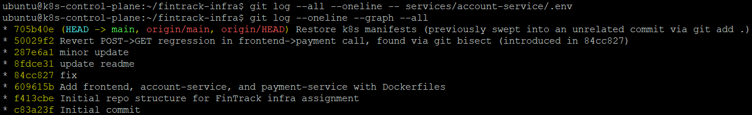

# FinTrack Infra — Release Night Chaos

**Author:** Kaushik Shettigar
**Assignment:** Kubernetes & Docker Black Box Challenge — Assignment #2, "Release Night Chaos: Stabilizing Hypergrowth Infra"

## Problem Statement

FinTrack, a fictional fintech startup, pushed a release to production that combined feature-toggle environment variables, a canary rollout of a new `account-service`, a Jenkins-based CI/CD pipeline, and an Istio service mesh for traffic shifting and retries. The morning after, the system was in chaos: canary traffic stuck at 100% despite failures, pods randomly OOMKilled, a stuck Jenkins pipeline, unreviewed merges to `main`, a MongoDB PVC stuck `Pending`, a failed rollback, and a leaked secret committed to Git.

This repo is a black-box simulation of that scenario: a small set of services and infrastructure configs, deliberately broken in the same ways described above, then diagnosed and repaired in four phases using only Git, Jenkins, Docker, Kubernetes, Istio, and GitHub Actions — no additional tools, no starting over from scratch.

## Solution Approach

Since no starter repo was provided, this project was built in two passes:
1. **Build + deliberately break** — a minimal 3-service system (frontend, account-service v1/v2, payment-service) plus MongoDB was built and intentionally misconfigured to reproduce each failure mode named in the assignment (OOMKilled pod, stuck PVC, broken Git history with a leaked secret, unreviewed direct-to-main commits, a fragile CI/CD pipeline).
2. **Diagnose + fix** — each phase is tackled using the specific diagnostic tools the assignment calls out (`git bisect`/`git log`/`git diff`/`git reflog`, `kubectl describe`/`logs`, Istio's `analyze`/tracing, Jenkins agent logs), with the fix and reasoning documented in [REPORT.md](./REPORT.md).

Infrastructure runs on two AWS EC2 instances (Ubuntu 22.04, `t3.medium`) forming a `kubeadm`-provisioned Kubernetes cluster: one control-plane node, one worker node, joined via Calico as the pod network CNI.

## Current Progress

**Phase 1 (Git Hygiene & Release Management) is complete.** A messy, secret-leaking, direct-to-main history was diagnosed with `git bisect`/`git diff`/`git reflog` and repaired with `git revert` and an interactive rebase, then `main` was locked down with branch protection, a pre-push secret scanner, and CI-gated PRs with automated release changelogs. Full evidence and reasoning: [REPORT.md](./REPORT.md).



Phases 2–4 (Jenkins, Kubernetes resilience, Istio traffic/security/observability) and the bonus chaos round are in progress — see REPORT.md for confirmed root causes on the phases already investigated.

## Architecture

```
                 ┌──────────────┐
   client  ───▶  │  frontend    │
                 └──────┬───────┘
                        │
          ┌─────────────┼──────────────┐
          ▼                            ▼
  ┌───────────────┐            ┌───────────────┐
  │ account-service│            │ payment-service│
  │  (v1 90% / v2 10% via Istio)│  (circuit breaker)│
  └───────┬───────┘            └───────────────┘
          │
          ▼
  ┌───────────────┐
  │   MongoDB      │
  │ (StatefulSet)  │
  └───────────────┘

  Istio sidecars on every pod: mTLS, retries, timeouts,
  distributed tracing via Jaeger.
```

## Dependencies

- 2x AWS EC2 instances (Ubuntu 22.04 LTS, `t3.medium` or larger)
- Kubernetes (`kubeadm`, `kubelet`, `kubectl`) — cluster built manually, not a managed offering
- containerd (cluster container runtime) + Docker Engine (for building/pushing images)
- Calico (pod network CNI)
- Istio (`demo` profile) + Jaeger + Prometheus addons
- Docker Hub account (image registry)
- Jenkins (CI/CD pipeline — see `ci/Jenkinsfile`)
- `gitleaks` (secret scanning, used in both a local pre-push hook and a GitHub Actions check)
- GitHub Actions (PR checks: gitleaks + flake8; changelog automation on tag push)

## Setup & Execution

### 1. Cluster
```bash
# On both nodes: install containerd, kubeadm, kubelet, kubectl
# On control-plane:
sudo kubeadm init --pod-network-cidr=192.168.0.0/16 --apiserver-advertise-address=<control-plane-private-IP>
kubectl apply -f https://raw.githubusercontent.com/projectcalico/calico/v3.28.0/manifests/calico.yaml
# On worker:
sudo kubeadm join <control-plane-ip>:6443 --token <token> --discovery-token-ca-cert-hash sha256:<hash>
```

### 2. Istio
```bash
curl -L https://istio.io/downloadIstio | sh -
istioctl install --set profile=demo -y
kubectl create namespace fintrack && kubectl label namespace fintrack istio-injection=enabled
```

### 3. Clone and configure hooks
```bash
git clone https://github.com/<your-username>/fintrack-infra.git
cd fintrack-infra
git config core.hooksPath hooks   # required once per clone — enables the pre-push secret scan
```

### 4. Build and push service images
```bash
cd services/account-service && docker build -t <dockerhub-username>/account-service:v1 . && docker push <dockerhub-username>/account-service:v1
cd ../payment-service && docker build -t <dockerhub-username>/payment-service:v1 . && docker push <dockerhub-username>/payment-service:v1
cd ../frontend && docker build -t <dockerhub-username>/frontend:v1 . && docker push <dockerhub-username>/frontend:v1
```

### 5. Deploy
```bash
kubectl apply -f k8s/
kubectl apply -f istio/
```

### 6. Verify
```bash
kubectl get pods -n fintrack
istioctl analyze -n fintrack
```

## Repository Structure

```
fintrack-infra/
├── services/            # frontend, account-service (v1/v2), payment-service — Flask apps + Dockerfiles
├── k8s/                 # Deployments, Services, StatefulSet, ResourceQuota
├── istio/               # PeerAuthentication, VirtualService, DestinationRule
├── ci/                  # Jenkinsfile
├── .github/workflows/   # PR checks (gitleaks + flake8), changelog automation
├── hooks/                # pre-push secret-scanning hook
├── screenshots/          # evidence referenced in REPORT.md
├── README.md
└── REPORT.md            # root causes, diagrams, what changed & why, alternatives considered
```

## Notes on Solo Execution

This assignment was completed solo, which affects two GitHub Flow practices in ways worth being upfront about:
- Branch protection on `main` requires PRs and passing CI checks, but **required approvals is set to 0** rather than 1+, since GitHub does not allow a PR author to approve their own pull request. On a real team this would be set to 1+ and enforced by an independent reviewer.
- Every PR in this repo was authored and merged by the same person. In a real team setting, review would catch issues before merge rather than after, as happened repeatedly during this project (see REPORT.md for specific examples).

See [REPORT.md](./REPORT.md) for root causes, architecture diagrams, and detailed reasoning behind every fix.
